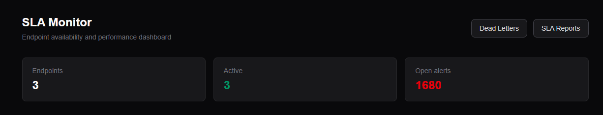
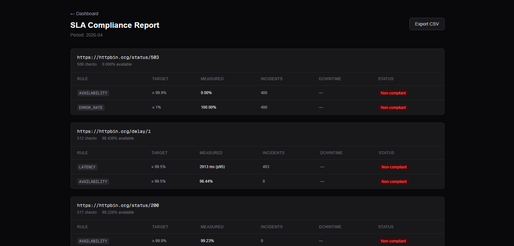
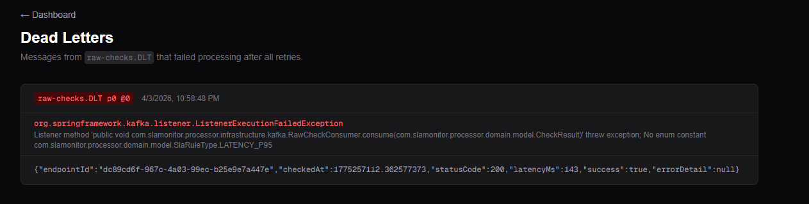

# SLA Monitor

A production-ready platform for monitoring the availability and performance of third-party APIs. Endpoints are registered once via REST; the system handles polling, SLA rule evaluation, alert dispatch, and compliance reporting with no changes required on the client side.

---

## Screenshots

> Place screenshots in `docs/screenshots/`. Details on what to capture and where are listed at the end of this file.

| Dashboard | SLA Reports |
|-----------|-------------|
|  |  |

| Dead Letters | Live Alert Stream |
|---|---|
|  |  |

---

## Architecture

```
                          ┌─────────────────────────────────────────────┐
                          │              Docker Compose                  │
                          │                                              │
  ┌───────────┐  HTTP     │  ┌─────────────────────┐                    │
  │  Client   │ ─────────►│  │   ingestor-service  │  :8081             │
  └───────────┘           │  │                     │                    │
                          │  │  - Endpoint CRUD    │                    │
  ┌───────────┐  polling  │  │  - HTTP polling     │──► raw-checks      │
  │ Monitored │ ◄─────────│  │  - Redis poll lock  │    (Kafka, 6p)     │
  │  APIs     │           │  └─────────────────────┘                    │
  └───────────┘           │                                              │
                          │  ┌─────────────────────┐                    │
                          │  │   sla-processor     │  :8082             │
                          │  │                     │◄── raw-checks      │
                          │  │  - Rule evaluation  │                    │
                          │  │  - Redis ZSET window│──► sla-violations  │
                          │  │  - DLT consumer     │    (Kafka, 3p)     │
                          │  └─────────────────────┘                    │
                          │                                              │
                          │  ┌─────────────────────┐                    │
                          │  │   alert-service     │  :8083             │
                          │  │                     │◄── sla-violations  │
                          │  │  - Alert state      │                    │
                          │  │  - Throttling       │──► Webhook         │
                          │  │  - SSE stream       │──► Slack           │
                          │  │  - Reports          │──► Email (SMTP)    │
                          │  └─────────────────────┘                    │
                          │           │                                  │
                          │  ┌────────▼────────────┐                    │
                          │  │     frontend        │  :3000             │
                          │  │  Next.js dashboard  │                    │
                          │  └─────────────────────┘                    │
                          │                                              │
                          │  PostgreSQL :5432  Redis :6379              │
                          │  Kafka :9092       Kafka UI :8090           │
                          └─────────────────────────────────────────────┘
```

---

## Tech Stack

| Layer | Technology |
|---|---|
| Backend language | Java 21 |
| Backend framework | Spring Boot 3.3 |
| Messaging | Apache Kafka (Confluent Platform 7.6) |
| Database | PostgreSQL 16 + Flyway |
| Cache / Throttling | Redis 7 |
| HTTP polling client | Spring WebClient (reactive, non-blocking) |
| Build | Maven (multi-module) |
| Frontend | Next.js 14, TypeScript, Tailwind CSS |
| Real-time | Server-Sent Events (SSE) |
| Container runtime | Docker + Compose |

---

## Prerequisites

- Docker 24+ and Docker Compose v2
- JDK 21 (only required for running services outside Docker)
- Node.js 20+ (only required for running the frontend outside Docker)

---

## Quick Start

```bash
# 1. Clone the repository
git clone https://github.com/your-org/sla-monitor-api.git
cd sla-monitor-api

# 2. Create the environment file
cp infra/.env.example infra/.env
# Edit infra/.env and fill in any secrets (SMTP credentials, Slack webhook URL, etc.)

# 3. Build and start everything
cd infra
docker compose up --build
```

Once all containers are healthy:

| Service | URL |
|---|---|
| Dashboard | http://localhost:3000 |
| ingestor-service API | http://localhost:8081 |
| sla-processor API | http://localhost:8082 |
| alert-service API | http://localhost:8083 |
| Kafka UI | http://localhost:8090 |

---

## Configuration

Copy `infra/.env.example` to `infra/.env` and set the variables for your environment. Sensitive values are never committed.

```env
# Database
SPRING_DATASOURCE_URL=jdbc:postgresql://postgres:5432/slamonitor
SPRING_DATASOURCE_USERNAME=sla
SPRING_DATASOURCE_PASSWORD=changeme

# Kafka
SPRING_KAFKA_BOOTSTRAP_SERVERS=kafka:9092

# Redis
SPRING_DATA_REDIS_HOST=redis
SPRING_DATA_REDIS_PORT=6379

# Polling — ingestor-service
POLLING_DEFAULT_INTERVAL_SECS=60
POLLING_DEFAULT_TIMEOUT_MS=5000
POLLING_MAX_CONCURRENT=50

# Alert throttling — alert-service
ALERT_THROTTLE_DEFAULT_WINDOW_SECS=300

# Notifications — alert-service (leave blank to disable a channel)
NOTIFICATION_WEBHOOK_URL=
NOTIFICATION_SLACK_WEBHOOK_URL=
NOTIFICATION_SMTP_HOST=
NOTIFICATION_SMTP_PORT=587
NOTIFICATION_SMTP_USER=
NOTIFICATION_SMTP_PASS=
NOTIFICATION_EMAIL_FROM=
NOTIFICATION_EMAIL_TO=
```

### Notification channels

Each notification channel is enabled only when its configuration is non-empty. All three channels (webhook, Slack, email) can be active simultaneously and are dispatched independently per alert.

| Channel | Required variable |
|---|---|
| Webhook | `NOTIFICATION_WEBHOOK_URL` |
| Slack | `NOTIFICATION_SLACK_WEBHOOK_URL` |
| Email | `NOTIFICATION_SMTP_HOST` + `NOTIFICATION_EMAIL_TO` |

---

## API Reference

### ingestor-service — port 8081

#### Register an endpoint

```
POST /endpoints
```

```json
{
  "serviceId": "3fa85f64-5717-4562-b3fc-2c963f66afa6",
  "url": "https://api.example.com/health",
  "httpMethod": "GET",
  "headers": { "Authorization": "Bearer token" },
  "timeoutMs": 5000,
  "intervalSecs": 30
}
```

#### List active endpoints

```
GET /endpoints
```

#### Get endpoint by ID

```
GET /endpoints/{id}
```

#### Update endpoint

```
PUT /endpoints/{id}
```

#### Deactivate endpoint

```
DELETE /endpoints/{id}
```

Returns `204 No Content`. The endpoint is soft-deleted (marked inactive); its history is preserved.

#### Polling health

```
GET /endpoints/{id}/health
```

Returns the outcome of the most recent polling attempt, including `success`, `statusCode`, `latencyMs`, and `checkedAt`. Returns `204 No Content` if the endpoint has never been polled.

---

### alert-service — port 8083

#### List alerts

```
GET /alerts?status=OPEN
```

Optional `status` filter: `OPEN`, `ACKNOWLEDGED`, `RESOLVED`.

#### Get alert detail

```
GET /alerts/{id}
```

#### Acknowledge alert

```
PATCH /alerts/{id}/acknowledge
```

Transitions status from `OPEN` to `ACKNOWLEDGED`.

#### Resolve alert

```
PATCH /alerts/{id}/resolve
```

Transitions status to `RESOLVED` and records `resolvedAt`.

#### Live alert stream (SSE)

```
GET /alerts/stream
```

`Content-Type: text/event-stream`. Each event is a JSON alert object pushed as it is created. The frontend connects to this endpoint automatically and updates in real time.

#### SLA compliance report

```
GET /reports/sla?month=2025-03&format=json
GET /reports/sla?month=2025-03&format=csv
```

`month` defaults to the previous calendar month when omitted. `format` is `json` (default) or `csv`. The CSV response is returned as a file attachment.

#### Incident timeline

```
GET /reports/incidents?from=2025-03-01T00:00:00Z&to=2025-04-01T00:00:00Z
GET /reports/incidents?endpointId={id}&from=...&to=...
```

Returns all alerts triggered within the given window, optionally filtered by endpoint.

---

### sla-processor — port 8082

#### Dead letters

```
GET /dead-letters?limit=100
```

Returns up to 500 records from the `raw-checks.DLT` dead letter topic. Each record includes the original payload, Kafka partition/offset, failure timestamp, exception class, and error message.

---

## Kafka Topology

```
raw-checks           partitions: 6   key: endpointId
  └── sla-processor  (group: sla-processors)
        ├── sla-ok           partitions: 3
        └── sla-violations   partitions: 3
              └── alert-service (group: alert-dispatchers)

raw-checks.DLT       partitions: 1   (malformed / unprocessable events)
```

All topics are created automatically at startup by the `kafka-init` container.

Partitioning by `endpointId` ensures that all checks for a given endpoint are processed by the same consumer instance, which is required for stateful rolling-window evaluation (p95 latency, error rate).

---

## SLA Rules

Rules are stored per endpoint and evaluated against every incoming check result.

| Rule type | Description | Threshold unit |
|---|---|---|
| `AVAILABILITY` | Endpoint unreachable (non-2xx or timeout) for N consecutive checks | `PERCENT` |
| `LATENCY_P95` | Rolling p95 latency over a configurable window exceeds threshold | `MS` |
| `ERROR_RATE` | Percentage of failed checks in a rolling window exceeds threshold | `PERCENT` |

Example rule payload:

```json
{
  "endpointId": "...",
  "ruleType": "LATENCY_P95",
  "thresholdValue": 500,
  "thresholdUnit": "MS",
  "windowSeconds": 300,
  "severity": "WARNING",
  "slaTarget": 99.9
}
```

`slaTarget` is optional and represents the contractual SLA percentage used in compliance reports. When set, the report compares the measured value against the target and marks the rule compliant or non-compliant.

---

## Alert State Machine

```
OPEN  ──►  ACKNOWLEDGED  ──►  RESOLVED
  │                              ▲
  └──────────────────────────────┘
```

- `OPEN` — created automatically when a violation is detected
- `ACKNOWLEDGED` — operator confirms awareness (`PATCH /alerts/{id}/acknowledge`)
- `RESOLVED` — either manually resolved or auto-resolved when subsequent checks pass

Alert throttling prevents the same rule from firing more than once per `windowSeconds` period (configurable per rule, defaulting to `ALERT_THROTTLE_DEFAULT_WINDOW_SECS`).

---

## Database Schema

Migrations are managed by Flyway. `ingestor-service` runs all migrations (V1–V6) on startup. The other services start with `spring.flyway.enabled: false`.

```
services
  id, name, api_key (bcrypt), created_at, active

endpoints
  id, service_id → services, url, http_method, headers (JSONB),
  timeout_ms, interval_secs, active, created_at

sla_rules
  id, endpoint_id → endpoints, rule_type, threshold_value,
  threshold_unit, window_seconds, severity, sla_target, enabled

checks
  id, endpoint_id → endpoints, checked_at, status_code,
  latency_ms, success, error_detail
  INDEX (endpoint_id, checked_at DESC)

alerts
  id, endpoint_id → endpoints, sla_rule_id → sla_rules,
  status, severity, triggered_at, acknowledged_at, resolved_at, metadata (JSONB)
  INDEX (endpoint_id, status)
  INDEX (triggered_at DESC)

dead_letters
  id, topic, partition_n, offset_n, failed_at,
  error_class, error_msg, payload (TEXT)
```

---

## Redis Usage

| Purpose | Structure | Key pattern | TTL |
|---|---|---|---|
| Poll deduplication lock | `SET NX EX` | `poll-lock:{endpointId}` | `interval_secs` |
| Endpoint config cache | String (JSON) | `endpoint:{endpointId}` | 5 min |
| SLA rules cache | String (JSON) | `rules:{endpointId}` | 5 min |
| Cache invalidation | Pub/Sub | channel: `cache:invalidate` | — |
| Alert throttle | `SET NX EX` | `alert-throttle:{ruleId}` | `windowSeconds` |
| Last poll record | String (JSON) | `poll-last:{endpointId}` | 24 h |
| Latency window buffer | ZSET (score = timestamp) | `latency:{endpointId}` | `window_seconds` |
| Error rate window buffer | ZSET (score = timestamp) | `errors:{endpointId}` | `window_seconds` |

---

## Project Structure

```
sla-monitor-api/
├── services/
│   ├── ingestor-service/       # Polling scheduler + endpoint registration
│   ├── sla-processor/          # SLA rule evaluation + DLT consumer
│   └── alert-service/          # Alert dispatch + SSE + reports
├── frontend/                   # Next.js dashboard
├── infra/
│   ├── docker-compose.yml
│   ├── .env.example
│   └── kafka/
│       └── init-topics.sh
├── db/
│   └── migrations/             # Flyway SQL reference copies
├── memory/                     # Agent memory (not application code)
└── pom.xml                     # Maven parent POM
```

Each backend service follows hexagonal architecture:

```
{service}/src/main/java/com/slamonitor/{service}/
├── domain/
│   ├── model/          # Pure domain entities (no framework dependencies)
│   ├── service/        # Domain logic (evaluators, throttlers)
│   └── port/           # Outbound port interfaces
├── application/
│   └── usecase/        # Orchestration (one class per operation)
├── infrastructure/
│   ├── kafka/          # Consumers, producers, DLT handlers
│   ├── persistence/    # JPA repositories, entity mappers
│   ├── cache/          # Redis adapters
│   ├── http/           # WebClient configuration, polling execution
│   ├── notification/   # Webhook, Slack, Email dispatchers
│   └── web/            # REST controllers, request/response records
└── config/             # Spring bean configuration
```

---

## Development Workflow

### Start infrastructure only (no service builds)

```bash
cd infra
docker compose up -d zookeeper kafka kafka-ui postgres redis
```

### Run a service locally against the containerized infrastructure

```bash
cd services/ingestor-service
./mvnw spring-boot:run
```

The default values in each `application.yml` point to `localhost`, so services connect to Docker-exposed ports without any extra configuration.

### Run everything via Compose

```bash
cd infra
docker compose up --build
```

### Rebuild a single service

```bash
cd infra
docker compose up --build ingestor-service
```

---

## Screenshots Guide

The table at the top of this README references images in `docs/screenshots/`. Create that directory and take the following screenshots after running the full stack with `docker compose up --build` and registering at least two endpoints with SLA rules.

### What to capture

| File | URL | What to show |
|---|---|---|
| `dashboard.png` | http://localhost:3000 | Endpoint table with active endpoints, health badges showing latency (e.g. "42ms · 5s ago"), and at least one open alert badge |
| `alert-stream.png` | http://localhost:3000 | The live alert stream panel with one or more incoming alert cards visible — trigger a violation first if the stream is empty |
| `reports.png` | http://localhost:3000/reports | SLA compliance table with at least one endpoint showing measured values, incident counts, and compliant/non-compliant badges |
| `dead-letters.png` | http://localhost:3000/dead-letters | Dead letters panel — either showing "no dead letters" (clean state) or a real DLT entry with its error class and payload |

### Optional but recommended

| File | URL | What to show |
|---|---|---|
| `kafka-ui.png` | http://localhost:8090 | Topics view listing `raw-checks`, `sla-ok`, `sla-violations`, and `raw-checks.DLT` with message counts |

### How to trigger data for screenshots

```bash
# 1. Register a service (replace with real UUIDs as needed)
curl -s -X POST http://localhost:8081/endpoints \
  -H "Content-Type: application/json" \
  -d '{
    "serviceId": "00000000-0000-0000-0000-000000000001",
    "url": "https://httpbin.org/status/200",
    "httpMethod": "GET",
    "timeoutMs": 3000,
    "intervalSecs": 15
  }'

# 2. Register an endpoint that will fail (to trigger alerts)
curl -s -X POST http://localhost:8081/endpoints \
  -H "Content-Type: application/json" \
  -d '{
    "serviceId": "00000000-0000-0000-0000-000000000001",
    "url": "https://httpbin.org/status/503",
    "httpMethod": "GET",
    "timeoutMs": 3000,
    "intervalSecs": 15
  }'

# 3. Wait one polling cycle (~15s), then open the dashboard
```

### Where to place the files

```
sla-monitor-api/
└── docs/
    └── screenshots/
        ├── dashboard.png
        ├── alert-stream.png
        ├── reports.png
        ├── dead-letters.png
        └── kafka-ui.png       (optional)
```

---

## License

MIT
